# Laboratorio1

## Integrantes
Santiago Amador Diaz,
David Stiven Sarria Arcila
## PARTE I (Trabajo Individual).

Averigua para qué sirve y como se usan estos comandos **git add** y **git commit -m “mensaje”**

#### git add 
Sirve para agregar cambios desde mi area de trabajo a un area donde dichos cambios seran subidos en un futuro, se puede usar el **git add y un nombre de archivo** para agregar a la etapa de stage archivos en especifico, o **git add .** para subir todos los archivos que fueron modificados en algun momento del desarrollo actual a la etapa de stage. 
#### git commit -m
Captura el estado del repositorio local en ese mismo momento, dando asi la informacion de si todo esta listo para hacer un posible push y subir todo a el repositorio principal o no.

Ademas el **-m** permite ponerle un nombre especifico a el commit para asi poder diferenciar los muchos commits que tiene un proyecto y que se realiza en cada uno de ellos.
***
## PARTE II
Owner y Colaborador editan el archivo README.md al mismo tiempo e intentan subir los cambios al mismo tiempo.

- ¿Que sucedió?

- Lo que paso es que al subir los dos push al mismo tiempo alguno es aceptado y el otro es rechazado
- Por lo tanto debe solucionar ese problema haciendo pull de los cambios

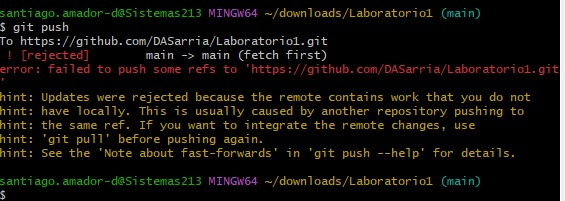

Luego lo que se debe hacer es eliminar la parte que tiene en el archivo README <<<<<<<, ======= y >>>>>>> o juntar lo necesario a mano.
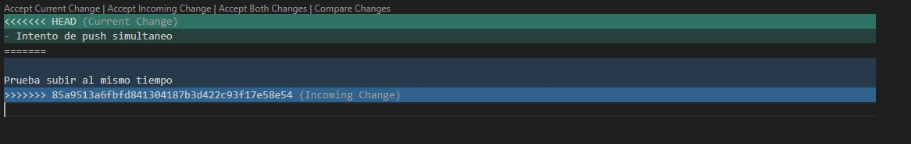

   - Ahora haciendolo en IntelliJ de la misma manera nos detecta el problema de compatibilidades
   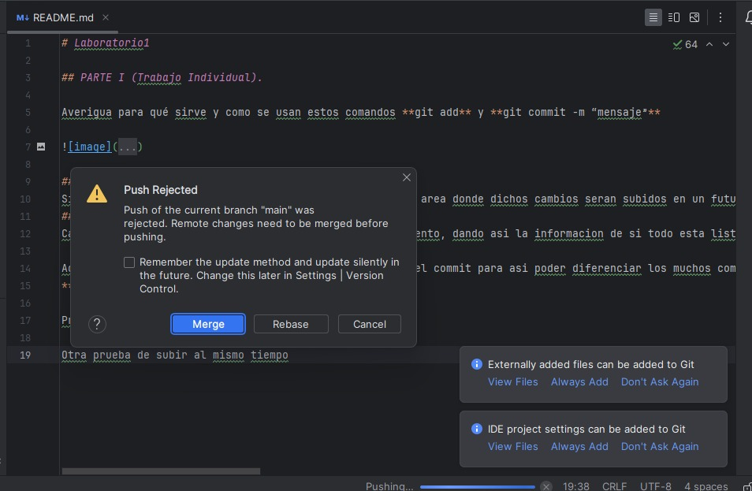
   por lo que debemos hacer el merge y unir o decidir con que versiones quedarnos
   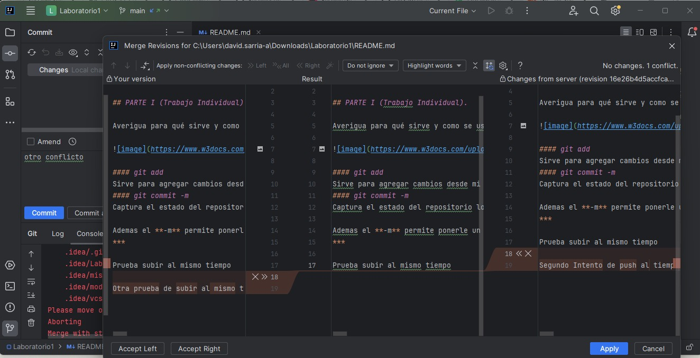

     - Lo que paso 
### PARTE III
- Hay una mejor manera de manejar los conflictos y es creando ramas para trabajar no sobre la main si no en una aparte y generar un pull request para que se junten con la rama main/master

- Un pull request es pedir la solicitud a otro desarrollador del equipo que acepte los cambios hechos para que se añadan a la rama main/master 
- Ambos creamos ramas dentro del repositorio :
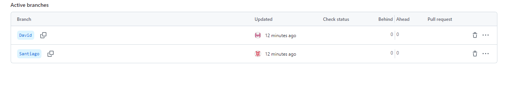
  - Independientemente cada uno hizo el checkout para cambiar de rama para hacer cambios sobre las creadas por cada uno:
  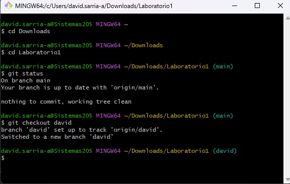
  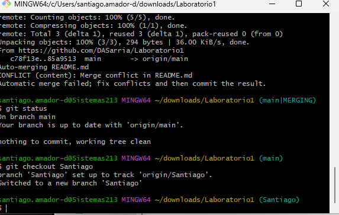

  Asi se ve cuando en una de las ramas se hacen cambios para saber que puede ser comparada y unidos los cambio a la rama main o master
  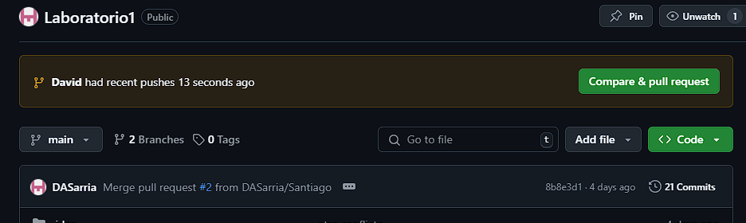

  

  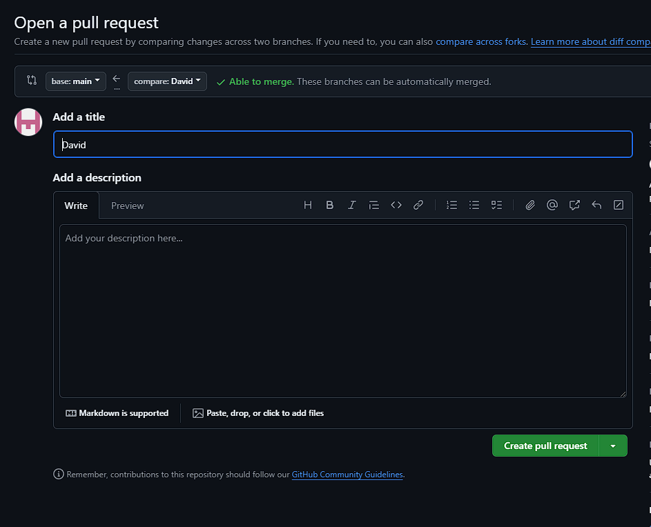

  Luego de crear el PR el otro integrante debe aceptar dichos cambios

  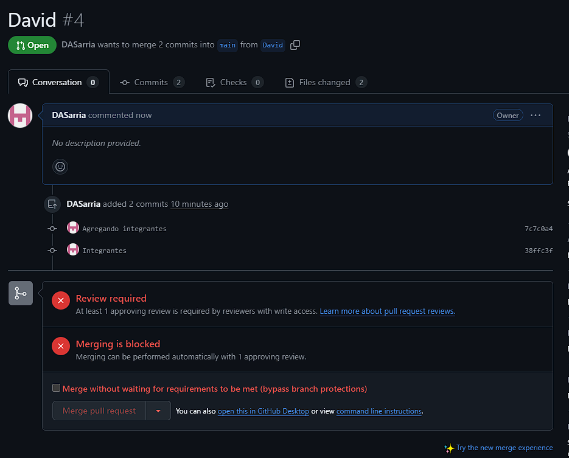

  Y luego dichos cambios se añadiran a la rama principal, o la rama a la que se le quiera agregar dichos cambios.

  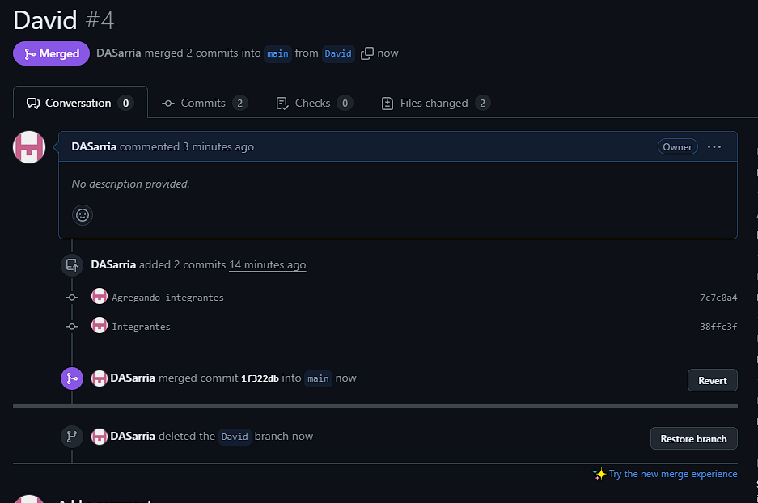

